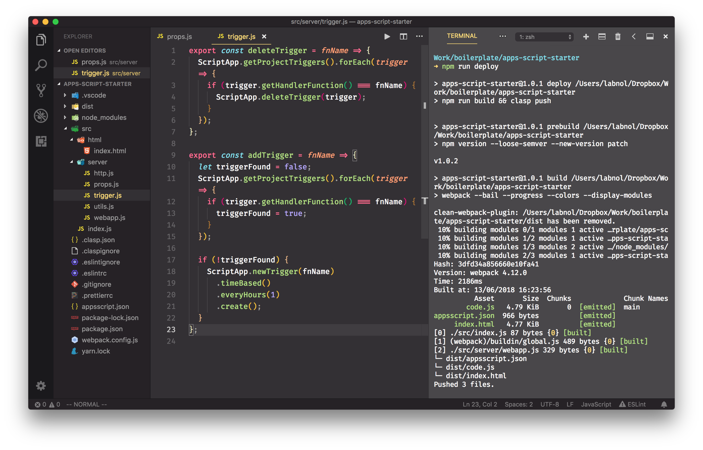
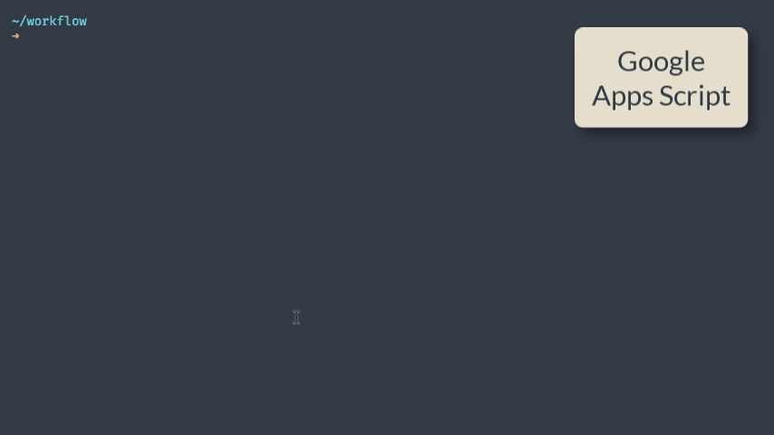
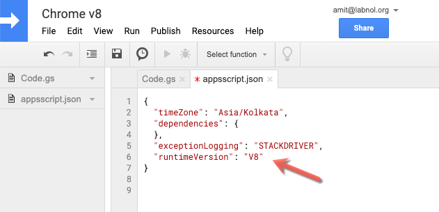
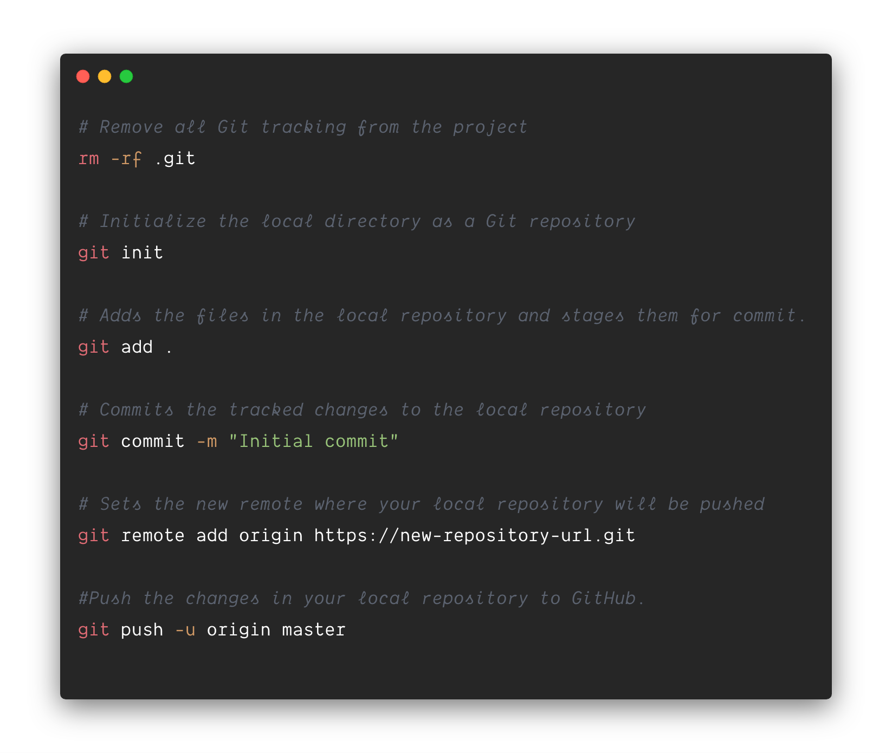

# Google Apps Script

Please follow the 👉 **[step-by-step video tutorial](https://www.youtube.com/watch?v=KxdCIbeO4Uk)** 👈 to get started with Apps Script development inside Visual Studio Code. It is recommended that you install the [Extension Pack](https://marketplace.visualstudio.com/items?itemName=labnol.google-apps-script) for working with Apps Script files in VS Code.

You can build Google Workspace add-ons (for Google Docs, Slides, Gmail and Google Sheets), web applications and workflow automation routines with next-generation JavaScript.

This kit is used by [Digital Inspiration](https://digitalinspiration.com/) for building popular Google add-ons including [Gmail Mail Merge](https://workspace.google.com/marketplace/app/mail_merge_with_attachments/223404411203), [Google Forms Notifications](https://workspace.google.com/marketplace/app/email_notifications_for_google_forms/984866591130) and [Document Studio](https://workspace.google.com/marketplace/app/document_studio/429444628321).



## Build with Google Apps Script 🚀

Setting up a modern development environment for building [Google Apps Script](https://www.labnol.org/topic/google-apps-script/) projects is easy and quick (**[video tutorial](https://www.youtube.com/watch?v=KxdCIbeO4Uk)**).

You do need to install `node.js` (version 16 or later) which includes the npm package manager.

### 📦 Getting Started

**1.** Clone the repository and install npm dependencies and [utilities](../TOOLS.md).

```bash
git clone --depth=1 https://github.com/labnol/apps-script-starter gas-project
cd gas-project
npm install
```

Update: The `git clone` command adds a .git folder to your folder that pertains to the Apps Script Starter project and not your local project. You should either re-init the repository or use `degit` to clone the repository.

```bash
npx degit labnol/apps-script-starter my-project
```

**2.** Log in to Google clasp and authorize using your Google account.

```bash
npx clasp login
```

**3.** Create a new Google Script bound to a Google Sheet (or set the type as standalone to create a standalone script in your Google Drive)

```bash
npx clasp create --type sheets --title "My Apps Script Project" --rootDir ./dist
```

**4.** Include the necessary [OAuth Scopes](../scopes.md) in the [appsscript.json](../appsscript.json) file

**5.** Deploy the project

```bash
npm run deploy
```

The `dist` directory contains the bundled code that is pushed to Google Apps Script.



#### Enable JavaScript v8 Runtime

Inside the Google Apps Script editor, select View > Show project manifest to open the `appsscript.json` manifest file in the editor. Add a new `runtimeVersion` field and set the value to `V8`. Save your script.



### The .claspignore file

The `.claspignore` file allows you to specify file and directories that you do not wish to not upload to your Google Apps Script project via `clasp push`.

The default `.claspignore` file in the Apps Script Starter kit will push all the JS and HTML inside the `rootDir` folder and ignore all the other files.

## :beginner: Using Git with Google Apps Script



Create a new repository in Github and make a note of the URL of the new repository. Next, open the terminal and run the above commands to push your Apps Script project to Github.

## Custom Google Sheet functions

Please read [the tutorial](../FUNCTIONS.md) on how to write custom functions for Google Sheets using Apps Script.

## Testing your Google Apps Script code

You can run tests with jest using

```bash
npm run test
```

This has limitations:

- You _can_ test code that has no dependencies to Google App Script code, e.g.

```js
const hasCpuTime = () => !(Date.now() - START_TIME > ONE_MINUTE * 4);
```

- You _can not_ test code that has dependencies to Google App Script code, e.g.

```js
function notTestable() {
    Logger.log("notTestable"); // <-- Google Apps Script function. Not callable in dev
    SpreadsheetApp.getUi(); // <-- Google Apps Script function. Not callable in dev
    ...
}
```

Check out [jest 'expects' here](https://jestjs.io/docs/expect)

## :fire: Meet the Developer


[Amit Agarwal](https://www.labnol.org/about) is a web geek, Google Developers Expert (Google Workspace, Google Apps Script) and author of [labnol.org](https://www.labnol.org/), a popular tech how-to website.

He frequently uses [Google Apps Script](https://www.labnol.org/topic/google-apps-script) to automate workflows and enhance productivity. Reach him on [Twitter](https://twitter.com/labnol) or email `amit@labnol.org`

### :cherry_blossom: Contribution

Contributions and feature requests are welcome. If you are using the Google Apps Script starter package and fixed a bug for yourself, please consider submitting a PR!

### :lock: License

[MIT License](https://github.com/labnol/apps-script-starter/blob/master/LICENSE) (c) [Amit Agarwal](https://www.labnol.org/about/)
